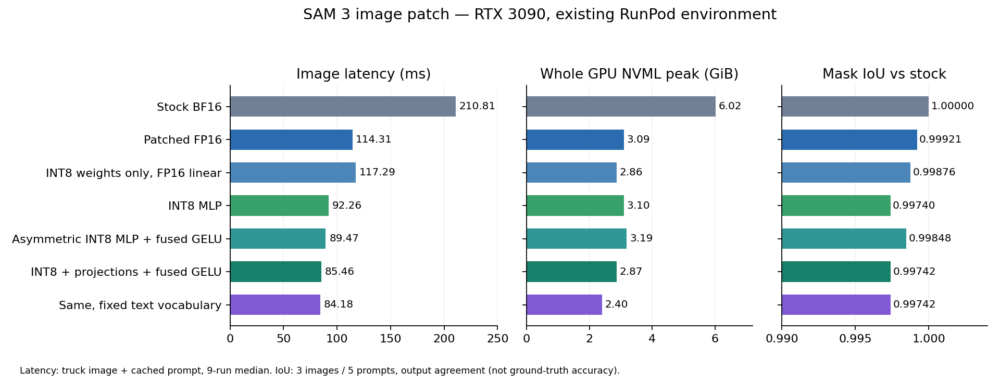

# SAM3-Turing 画像パッチ

通常の画像推論には `apply_turing_patch(processor, compile=True)` を使う。
起動の軽さを優先する場合は `compile=False`、追加のカーネル探索には
`compile="max-autotune"` も選べる。元のモデルファイルを編集せず、実行時に適用する。

## RTX 3090での結果



このRunPodコンテナの既存Python / NVIDIA PyTorch 2.10.0a0 / CUDA 13.0で測定した。
専用の仮想環境は使用していない。Turing 6GB実機は未検証。
6GBでもRTX 2060とGTX 1660系は構成が異なり、GTX 16系にはTensor Coreがない。
[NVIDIA公式比較表](https://www.nvidia.com/en-eu/geforce/graphics-cards/compare/)を参照。
FP16・INT8・コンパイルの効果は各GPUで個別に比較する。

| 構成 | 1画像 ms | PyTorch allocated GiB | GPU全体 NVML GiB | マスク平均IoU（素の状態比） |
|---|---:|---:|---:|---:|
| 素の状態・BF16 | 210.81 | 4.994 | 6.017 | 1.0 |
| 採用FP16・コンパイルなし（Round 10） | 169.77 | 1.997 | 3.144 | 0.99917 |
| 採用FP16・コンパイルあり | **114.31** | **1.862** | **3.095** | **0.99921** |
| FP16・新規語句を毎回処理 | 116.32 | 1.862 | 3.095 | 0.99920 |
| 重みのみINT8・MLP＋Attention射影 | 117.29 | 1.456 | 2.862 | 0.99876 |
| 画像MLPのINT8＋コンパイル | **92.26** | **1.625** | **3.099** | **0.99740** |
| INT8＋Attention射影＋GELU融合 | **85.46** | **1.455** | **2.872** | **0.99742** |
| 非対称INT8・MLP＋GELU融合 | **89.47** | **1.628** | **3.190** | **0.99848** |
| 非対称INT8＋Attention射影＋GELU融合 | 85.01 | 1.456 | 2.851 | 0.99805 |
| 同＋重みスケール調整 | 86.91 | 1.456 | 2.851 | 0.99807 |
| 同＋重み調整＋CPUテキスト・cacheあり | **86.30** | **0.793** | **2.368** | **0.99806** |
| 同＋CPUテキストMLPもINT8・cacheあり | 84.79 | 0.793 | 2.368 | 0.99779 |
| 同＋CPUテキストMLPもINT8・新規語句を毎回処理 | **100.80** | **0.793** | **2.345** | **0.99779** |
| 画像追加パッチ＋CPU FP32・padding省略・新規語句 | **85.37** | **0.782** | **2.573** | **0.99800** |
| 同・CPUテキストMLPもINT8 | **84.38** | **0.782** | **2.321** | **0.99774** |
| CPUテキスト＋FP16・語句cacheあり | 113.39 | 1.202 | 2.370 | 0.99919 |
| CPUテキスト＋INT8・射影・GELU融合・cacheあり | **84.94** | **0.793** | **2.333** | **0.99742** |
| CPUテキスト＋INT8・新規語句を毎回処理 | 187.33 | 0.793 | 2.333 | 0.99742 |
| 固定語句＋FP16 | 114.52 | 1.256 | 2.411 | 0.99921 |
| 固定語句＋INT8・射影・GELU融合 | **84.18** | **0.850** | **2.401** | **0.99742** |
| 画像・テキストINT8＋融合・新規語句を毎回処理 | 87.64 | 1.265 | 2.849 | 0.99745 |

FP16コンパイル版は、素の状態から時間を約46%、GPU全体の使用量を約49%削減した。
初回の採用版153.53ms、前回121.30msから、検出処理の一括コンパイルでさらに短縮した。
同じ語句ではテキスト特徴を再利用する。INT8＋射影＋GELU融合の時間削減は約59%。
INT8は追加学習なしの任意パッチで、速度・メモリと出力差の交換条件を選べる。

表の通常FP16・MLPのINT8・素の状態はRound 14、GELU融合・語句の追加比較はRound 18。
非対称INT8の2行はRound 32、重みのみINT8はRound 34、CPUテキストはRound 42の公開API測定。
重みスケール調整とCPU併用の2行はRound 44。
コンパイルなしは変更のない経路のRound 10値。
GPUで新規語句を毎回処理する行は `text_cache_size=0, compile_text=True`。
CPUテキストは `compile_text=False`、AMD EPYC 7763を4スレッドで使った。
CPU uncachedは試作146.64ms・公開版187.33msと変動した。公開版9回は147〜211ms。
CPU時間を含むため、語句が毎回変わる用途ではこの待ち時間も選択基準になる。
GELU融合なしでAttention射影だけを追加した公開版は90.19ms・NVML 2.854GiBだった。

速度は `truck.jpg` + `truck` の `set_image` + `set_text_prompt` 全体。
前処理とGPU転送を含み、画像ファイルの読込み・モデル構築は含めない。
2回ウォームアップ後、9回の中央値。TF32は全構成でOFF。
NVMLは5ms間隔のGPU全体の標本最大値。メモリはパッチ適用後の推論時の最大値で、
モデル構築時は各JSONの `build_allocated_bytes` に別途記録した。

結果差は3画像・5条件（truck、paper bag、child、wheel、空のelephant）で比較した。
検出数は素の状態・採用FP16・INT8とも **1 / 4 / 6 / 4 / 0**。
FP16のマスク差は **285 / 18,038,400画素（0.00158%）**、
score最大差 **0.00391**、box最大差 **0.49画素**。
INT8は **836画素（0.00463%）**、score最大差 **0.01367**、box最大差 **0.66画素**。
GELU融合＋Attention射影のINT8では **916画素（0.00508%）**、score最大差 **0.00781**、
box最大差 **0.49画素**。検出数は同じ。
非対称INT8のMLP版は **544画素（0.00302%）**、score最大差 **0.00586**、box最大差 **0.47画素**。
Attention射影もINT8にする非対称版は **735画素（0.00407%）**、score最大差 **0.01172**、
box最大差 **1.44画素**だった。マスク差が減る一方、box差は構成によって増える。
重みのみINT8・射影込みは **389画素（0.00216%）**、score最大差 **0.00537**、
box最大差 **0.51画素**だった。これらも検出数は同じ。
CPUテキストのFP16画像版は289画素、INT8画像版は915画素変化し、検出数は同じだった。
後者のscore最大差0.00830、box最大差0.51画素。
非対称INT8＋重み調整は697画素・score最大差0.00391・box最大差0.57画素。
CPUテキストも組み合わせると698画素となり、検出数は両方とも同じだった。
CPUのテキストMLPもINT8にした場合は922画素・score最大差0.02051・box最大差0.52画素。
キャッシュあり・なしとも全5条件の比較値は同じで、検出数も一致した。
boxの対応付け後にマスクを比較した。正解ラベルに対する精度評価ではない。

コンパイルの初回推論は、今回のキャッシュ状態でFP16が約20.5秒、MLPのINT8が約22.3秒だった。
Round 13で新しい検出Graphをコンパイルした際は約48秒かかった。キャッシュ状況で変わる。
新しいINT8＋GELU融合Graphは約55〜57秒、同系統のキャッシュを使った固定語句版は約21秒だった。
非対称INT8の公開版はMLPのみ約63秒、Attention射影込み約37秒だった。
重みのみINT8の公開版は、今回のキャッシュ状態で約23秒だった。
CPUテキスト版も約21〜23秒だった。重み調整の公開版は約24秒だった。

FlashAttentionを使わずefficient Attentionに固定した3090上の更新版は、
FP16が118.83ms・NVML 3.081GiB、INT8＋射影＋GELU融合が90.93ms・2.892GiBだった。
検出数は同じで、後者の平均mask IoUは0.997066。
これはAttention経路の確認であり、Turing実機の速度測定ではない。
画像追加パッチ＋CPUテキストpadding省略を併用した更新比較では、INT8画像＋CPU FP32が
90.60ms・allocated 0.783GiB・NVML 2.549GiB・IoU 0.998116だった。
CPUテキストもINT8にすると90.01ms・allocated 0.782GiB・NVML 2.351GiB・IoU 0.997886。
検出数は両方1/4/6/4/0。新規語句を毎回処理し、CPU側のAttention backendは変更していない。
[追加パッチのefficient比較](../experiments/round58.json)

公開モジュール内の7種類のTriton kernelは、Triton 3.5.0でsm75向けのオフラインcompileに通過した。
実験用の独自INT8 GEMMはsm75のloweringで失敗したため、公開パッチには採用していない。
公開INT8の行列積は引き続き`torch._int_mm`を使用する。この確認もTuring実機の動作・速度の確認ではない。
[compile結果](../experiments/results/sm75_compile_check.json)

[全候補の表](../experiments/results/README.md) / [CSV](../experiments/results/summary.csv) /
[採用FP16 JSON](../experiments/results/r14_fp16_control.json) /
[採用INT8 JSON](../experiments/results/r14_int8_control.json) /
[INT8・射影・GELU融合JSON](../experiments/results/accepted_fused_attention.json) /
[固定語句INT8 JSON](../experiments/results/compact_fixed_all_int8.json) /
[非対称INT8・MLP JSON](../experiments/results/accepted_asymmetric_mlp.json) /
[非対称INT8・射影 JSON](../experiments/results/accepted_asymmetric_attention.json) /
[重みのみINT8 JSON](../experiments/results/accepted_weight_only_attention.json) /
[CPUテキスト＋FP16 JSON](../experiments/results/accepted_cpu_text_fp16.json) /
[CPUテキスト＋INT8 JSON](../experiments/results/accepted_cpu_text_int8.json) /
[CPUテキストuncached JSON](../experiments/results/accepted_cpu_text_int8_uncached.json) /
[重み調整＋非対称INT8 JSON](../experiments/results/accepted_optimized_asymmetric.json) /
[同＋CPUテキスト JSON](../experiments/results/accepted_optimized_asymmetric_cpu.json) /
[CPU動的INT8・cacheあり JSON](../experiments/results/accepted_cpu_dynamic_text.json) /
[CPU動的INT8・cacheなし JSON](../experiments/results/accepted_cpu_dynamic_text_uncached.json)

完了済みラウンドの比較は314候補・322試行（再測定と失敗を含む）。追加候補も継続中。
候補と不採用の理由は [探索メモ](../experiments/NOTES.md) に残した。

## 使い方

```python
import torch
from PIL import Image
from sam3.model_builder import build_sam3_image_model
from sam3.model.sam3_image_processor import Sam3Processor
from sam3.turing import apply_turing_patch

# このNGCコンテナではCPU初期化を1スレッドにすると安定する。
torch.set_num_threads(1)
model = build_sam3_image_model()  # checkpoint_path=... も指定可能
torch.set_num_threads(4)
processor = apply_turing_patch(Sam3Processor(model), compile=True)

state = processor.set_image(Image.open("assets/images/truck.jpg").convert("RGB"))
result = processor.set_text_prompt(prompt="truck", state=state)
masks, boxes, scores = result["masks"], result["boxes"], result["scores"]
```

画像・batch 1・推論専用。テキストと幾何box prompt、しきい値変更、空出力に対応する。
SAM 1形式のインスタンス操作・学習・SAM 3.1動画への適用は対象外。
パッチはモデル/processorの組に1回適用する。解除する場合はモデルを作り直す。

語句キャッシュは最大16件。`text_cache_size=0` で無効化できる。
毎回新しい語句を処理する場合は `compile_text=True` を追加すると、文字列処理を除いた
テキストTransformerもコンパイルする。初回のコンパイル時間は増える。
固定語句だけを使う用途では、次を追加してテキストエンコーダの重みを解放できる。
この用途では `compile_text` を省き、最初の画像推論の前に固定語句を登録する。

```python
from sam3.turing import freeze_text_prompts
freeze_text_prompts(processor, ["truck", "wheel", "person", "visual"])
```

その後は未登録の語句がエラーになる。幾何boxだけの指定には `visual` を含める。

自由な語句を使いながらVRAMを減らす場合は、最初の画像推論の前にテキストエンコーダーを
CPUへ移せる。`compile_text=False`（既定）で作成し、次を追加する。

```python
from sam3.turing import offload_text_encoder

offload_text_encoder(processor)
```

語句はCPUのFP32で処理し、特徴だけGPUへ戻す。同じ語句は既存のLRUキャッシュから再利用する。
新規語句を処理するときの時間は増える。画像側のINT8やpacked masksと組み合わせられるが、
テキスト側のINT8（`text=True`）と`compile_text=True`には併用しない。
固定語句への制限はなく、幾何box用の`visual`も必要になった時点で処理する。
CPU側には約1.32GiBのテキスト重みを保持する。画像状態の再利用・box・packed出力・
固定語句への切替も[API確認](../experiments/results/api_smoke_cpu_text.json)で通過した。

CPUテキストで短い語句を使う場合は、EOS以降のpadding計算を省ける。
GPUへ渡す前に元のtoken数へ戻すため、後段のTensor形状は維持する。

```python
offload_text_encoder(processor, trim_padding=True)
```

因果Attentionのある標準テキストエンコーダーが対象。CPU演算の形状が変わるため、
小さい丸め差は発生する。語句が長くpaddingが少ない場合は短縮も小さくなる。

公開版の新規語句測定はFP32で87.48ms・698画素変化、INT8併用で87.64ms・904画素変化。
どちらも5条件の検出数は1/4/6/4/0で、試作版と比較指標が一致した。
[FP32測定](../experiments/results/accepted_cpu_trimmed_text_fp32.json) /
[INT8測定](../experiments/results/accepted_cpu_trimmed_text_int8.json)

新規語句の待ち時間とCPUの重み容量を減らす場合は、CPUテキストMLPも動的INT8にできる。
既定のCPU FP32と出力が変わるため、明示的な追加設定にしている。

```python
offload_text_encoder(processor, int8_mlp=True)
```

48個のテキストMLP LinearだけをCPUのper-tensor動的INT8へ変換する。
Attention・単語埋め込み・resizerはCPU FP32。`apply_int8_patch(..., text=True)`による
GPUテキストINT8とは別の設定で、両者は併用しない。語句cacheと固定語句への切替は維持する。
速度はCPUとスレッド数にも依存する。このコンテナではAMD EPYC 7763・4スレッド・
PyTorchのx86量子化backendを使用した。
別比較では、padding省略なしのCPU INT8が4スレッド105.17ms、8スレッド87.90msだった。
初期化後の`torch.set_num_threads(8)`もこのCPUでは選択肢になる。
パッチ自体はCPUスレッド数を変更しない。[スレッド数比較](../experiments/round50.json)

公開版は語句cacheあり84.79ms、cacheなし100.80ms。直前の同じ画像側構成の
CPU FP32・cacheなし155.84msから約35%短縮した。CPUの通常parameterと量子化重み/biasの
合計は約1.32GiB→0.76GiBになった。プロセスRSSを表す値ではない。
検出数は1/4/6/4/0、平均mask IoU 0.997790、922画素が変化した。
[公開版JSON](../experiments/results/accepted_cpu_dynamic_text_uncached.json) /
[FP32との比較](../experiments/round48.json) /
[画像状態・box・固定語句・packed maskの確認](../experiments/results/api_smoke_cpu_dynamic_text.json)

速度優先で解像度を下げる場合は、最初のprocessor作成時に指定する。パッチがRoPEも調整する。
標準値は1008を維持し、縮小はマスク形状との交換条件として選ぶ。
Round 30で同じINT8＋Attention射影＋GELU融合を比べた結果は次の通り。

| 入力解像度 | ms | GPU全体 NVML GiB | 平均mask IoU | 最小mask IoU | box最大差 px |
|---|---:|---:|---:|---:|---:|
| 1008 | 86.78 | 3.026 | 0.99742 | 0.99319 | 0.49 |
| 896 | 76.04 | 2.712 | 0.97389 | 0.89985 | 4.32 |
| 840 | 70.47 | 2.714 | 0.97280 | 0.87577 | 7.89 |
| 784 | 63.84 | 2.692 | 0.97082 | 0.88517 | 8.63 |
| 672 | 40.68 | 2.854 | 0.95396 | 0.78244 | 17.62 |
| 560 | 35.23 | 2.577 | 0.93205 | 0.61447 | 26.19 |

全設定で5条件の検出数は1/4/6/4/0。allocatedは1.298〜1.455GiBだった。
IoUとbox差は元の1008・BF16出力との一致度。小さい物体などでは平均より差が大きい。
縮小版の初回は、この時点のキャッシュ状態で約84〜95秒だった。
[解像度比較の設定](../experiments/round30.json) / [672の測定JSON](../experiments/results/compact_int8_resolution672.json)

上のモデル作成例で、processor作成と追加パッチを次の形にする。

```python
from sam3.turing_int8 import apply_int8_patch

processor = apply_turing_patch(Sam3Processor(model, resolution=784), compile=True)
apply_int8_patch(processor, attention_projections=True, fused_mlp=True)
```

## 任意の画像追加パッチ

ViTブロックの出力とdecoder FFNをFP16へ揃え、mask headの最後の射影を前計算する
3つの変更をまとめた。`compile=True`で作り、最初の推論より前に1回適用する。
通常パッチや画像INT8を設定した後に呼ぶ。

```python
from sam3.turing_refinements import apply_image_refinements

apply_image_refinements(processor)
```

公開版のINT8画像＋CPUテキストは83.08ms・allocated 0.837GiB・NVML 2.382GiBだった。
5条件の検出数は1/4/6/4/0で、673画素変化、平均mask IoU 0.997999、
score最大差0.01074、box最大差0.556画素。丸め方が変わるため、通常パッチの任意追加にしている。
同じ画像側でテキストをGPUに残す版は83.08ms・NVML 2.813GiB・675画素変化。
画像INT8を使わないFP16画像＋CPUテキストでは112.09ms・293画素変化だった。
[CPUテキスト版](../experiments/results/accepted_refined_int8_cpu.json) /
[GPUテキスト版](../experiments/results/accepted_refined_int8_gpu.json) /
[FP16画像版](../experiments/results/refined_fp16_cpu.json)

入力前処理は通常のままで、追加の独自CUDA kernelも使わない。
neck compileと正規化も加えた5変更の候補は83.78msだったため、今回はこちらの3変更を選んだ。
GPU割当の試作値0.782GiBと公開値0.837GiBには差があり、公開値を記載している。

CPUのpadding省略も組み合わせる場合は、次の順で適用する。
画像INT8は上の例と同じ非対称GELU＋重みスケール調整を使う。

```python
from sam3.turing import offload_text_encoder
from sam3.turing_refinements import apply_image_refinements

offload_text_encoder(processor, trim_padding=True)
apply_image_refinements(processor)
```

CPU FP32では新規語句を毎回処理して85.37ms・allocated 0.782GiB・NVML 2.573GiB。
674画素変化・平均IoU 0.997997・score最大差0.01074・box最大差0.571画素だった。
CPU側の重み容量も減らす場合は`int8_mlp=True`を加える。この版は84.38ms・
allocated 0.782GiB・NVML 2.321GiB、822画素変化・IoU 0.997737・score最大差0.02783・
box最大差0.552画素。どちらも検出数1/4/6/4/0は一致した。速度差は小さく、
この短い語句ではCPU FP32を出力差の小さい選択肢にできる。
[併用FP32測定](../experiments/results/accepted_refined_trimmed_fp32.json) /
[併用INT8測定](../experiments/results/accepted_refined_trimmed_int8.json)

全機能を併用した[API確認](../experiments/results/api_smoke_refined_cpu_trimmed.json)でも、
画像状態の再利用・box・しきい値変更・空出力・固定語句への切替・packed maskを通過した。

## 取り込んだ変更

- BF16を強制するViT MLPを、FP16 autocastに従うLinear＋GELUへ置換。
- Linear / Conv / Attentionの射影重みと単語埋め込みをFP16化。decoderのFP32専用FFNは維持。
- autocastの重みキャッシュを無効化し、FPNのclone、使わない段・位置キャッシュを削減。
- テキスト特徴をLRUキャッシュし、補間後のsigmoidをin-place化。
- 既知の特徴サイズを使い、box位置バイアスのGPUスカラー読み取りを省く。
- 任意で画像エンコーダと、テキストpromptからの検出・マスク生成をまとめてコンパイル。
  processorが使う4配列をCUDA Graphの外でcloneし、次の推論による上書きを防ぐ。
  box promptや早期query選別には段ごとのコンパイル経路を使う。
  直接modelを呼ぶ場合は元の出力辞書を返す。
- 任意でテキストTransformerをコンパイル。自由な語句を残す省VRAM用途ではCPUへ移動。

融合MLP、GELU近似、channels-last、PixelDecoderのin-place化、早期query選別を
個別・組み合わせで試したが、最終構成への追加効果は小さかった。
早期選別は `early_filter=True` として試せるが、既定では無効。
ヘッド射影の再結合、Attention固定、MLP分割、arena再利用、非コンパイルの実数RoPEは
今回の3090では標準採用に至らなかった。候補コードと測定値は実験ディレクトリに残した。

## 任意のINT8

速度・メモリをさらに優先する場合は、画像MLPやAttention射影をINT8にする追加パッチを使える。
追加学習は不要。FP16版より出力差が増えるので、通常パッチとは別の明示的な選択にした。
通常パッチを適用した直後、最初の推論の前に追加する。

```python
from sam3.turing_int8 import apply_int8_patch

apply_int8_patch(processor, attention_projections=True, fused_mlp=True)
```

`attention_projections=False`（既定）なら画像MLPだけをINT8化する。
`True`ではViTのQKV射影・出力射影も対象にする。Attention本体にはFP16のQ/K/Vを渡す。
`fused_mlp=True`はMLPの逆量子化・通常GELU・再量子化を融合する。Tritonの8 warps設定を使い、
FP16の中間丸めを残す。`False`（既定）では各演算を個別に呼ぶ。
`text=True` はテキストMLPも対象にする。`vision=False, text=True` ならテキストだけ。
今回の `text=True, attention_projections=True, fused_mlp=True` と
`compile_text=True, text_cache_size=0` の組合せは、新規語句を毎回処理して87.64msだった。
text compileを省く場合の起動時間・速度は別の交換条件になる。
`asymmetric_gelu=True` を指定すると、GELU後だけをtokenごとの非対称INT8にする。
`fused_mlp=True` と組み合わせて使う。重みの行和とzero pointでINT32の積を補正し、
通常のINT8とは異なる出力差の選択肢になる。4 warpsの融合kernelを使う。
今回のMLPのみの公開版は89.47ms・平均mask IoU 0.998477・544画素変化だった。
`attention_projections=True` も加えると85.01ms・735画素変化だが、box最大差は1.44画素になる。

```python
apply_int8_patch(processor, fused_mlp=True, asymmetric_gelu=True)
```

`optimize_weight_scales=True`は、初期化時にINT8重みの刻み幅を探索して二乗誤差を減らす。
推論の演算は増えず、画像による較正も不要。出力差が小さくなるかは構成による。
今回の非対称GELU＋射影では、調整なしの735画素変化から697画素へ減り、
score最大差0.01172→0.00391、box最大差1.44→0.57画素となった。
直近の比較で時間は85.67→86.91ms。通常の対称GELUや重みのみ版では改善が一定せず、既定は無効。

```python
from sam3.turing import offload_text_encoder

apply_int8_patch(
    processor,
    attention_projections=True,
    fused_mlp=True,
    asymmetric_gelu=True,
    optimize_weight_scales=True,
)
# 自由な語句のままVRAMも減らす場合。compile_text=Falseで作成する。
offload_text_encoder(processor)
```

このCPU併用構成は86.30ms・allocated 0.793GiB・NVML 2.368GiB、平均IoU 0.998065だった。
語句を繰り返す測定であり、CPUで新しい語句を処理する場合の待ち時間は前述の通り増える。

`weight_only=True` は重みをINT8で保存し、各層の計算時にFP16へ展開して通常の
`linear` に渡す。入力をINT8に量子化せず、選択した層はFP16で行列計算する。
`fused_mlp` / `asymmetric_gelu` とは併用しない。

```python
apply_int8_patch(processor, attention_projections=True, weight_only=True)
```

この構成は117.29ms・allocated 1.456GiB・NVML 2.862GiB、平均mask IoU 0.998763だった。
MLPだけなら115.57ms・1.574GiB・3.030GiB、平均IoU 0.999030・343画素変化。
通常FP16に近い速度で、重みのメモリを減らす選択肢として使える。

従来の `apply_int8_mlp_patch` もMLPだけの入口として利用できる。
解除する場合はモデルを作り直す。

## 多数の二値マスクを小さく返す

`packed_masks=True` は、確率配列を保持せず、二値マスクを1画素1bitで返す追加オプション。
Tritonを使用する。通常の `masks` / `masks_logits` の代わりに
`masks_packed` と `mask_shape` を返す。

200 queryの実モデルlogitを4Kへ拡大する出力部品の比較では、dense二値出力が
24.10ms・6.243GiBに対し、8枚ずつ生成してbitpackすると **28.64ms・0.505GiB**。
出力は約198MiB。抽出した8マスク・66,355,200画素の比較では差0だった。
これは画像全体の速度ではなく、4K出力部品のストレス試験。
さらに一時メモリを減らす `mask_chunk_size=1` は46.06ms・0.288GiBだった。
従来経路のchunk既定値は8。[測定JSON](../experiments/results/packed_masks.json)

継続最適化では、この4段階を1つのTriton kernelに融合した。同じ4K出力部品の
比較で、従来のchunk 8は28.72ms・0.505GiB、新方式は **8.18ms・0.257GiB**。
200マスク全体の **1,658,880,000画素中1画素** が閾値付近の丸めで異なった。
奇数サイズ、縮小、閾値付近の値、1×1入力の追加比較は差0。
FP16/FP32ではこの方式を既定にした。`mask_chunk_size`は他のdtypeでの従来経路に使う。
直接 `resize_and_pack_masks(logits, size, fused=False)` を呼べば従来経路も選べる。
[追加測定JSON](../experiments/results/fused_masks.json)

続いてブロックサイズを調整し、FP16ではsigmoidの丸めに対応するcutoffを直接比較すると
**6.18ms**まで短縮できた。現在の既定はこの方式。全65,536通りのFP16ビットパターンで
PyTorchのsigmoid→閾値処理と一致し、200枚の4Kマスクも先の融合版から変化0だった。
FP32はsigmoidを使う。[カーネル調整の測定JSON](../experiments/results/mask_pack_tuning.json)

```python
from sam3.turing_masks import unpack_masks

processor = apply_turing_patch(Sam3Processor(model), packed_masks=True)
state = processor.set_text_prompt("truck", processor.set_image(image))
h, w = state["mask_shape"][-2:]
first_mask = unpack_masks(state["masks_packed"][:1], (h, w))
```

## パッチと実験を再利用する

単独の適用ファイルは [patches/turing-image.patch](../patches/turing-image.patch)。
SAM3-Turingのこの変更を含まない上流チェックアウトで `git apply` し、上記APIを呼ぶ。
既にこのブランチを使っている場合は適用不要。

比較ループは [experiments/README.md](../experiments/README.md) を参照。
既存のPython環境で不足していた `timm`、`ftfy`、`iopath`、`portalocker` だけを追加した。
PyTorchやCUDAは入れ替えていない。

基準ソース: `2345a4ad109ac29c569da749c91d84f10dc08c40`。
重み: `facebook/sam3`、revision `3c879f39826c281e95690f02c7821c4de09afae7`。
入力資料は添付のFP16 / 20USD / GPU validationの3アーカイブ。
