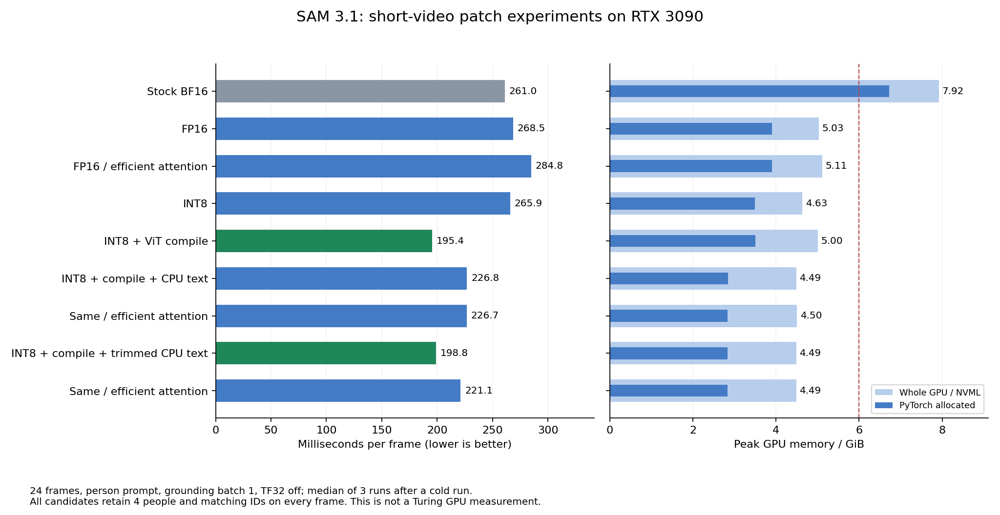

# Experimental SAM 3.1 video optimizations



These are **experimental video patches measured on an RTX 3090**. They have not
been validated on the 6 GB Turing device. Use the separate
[video experiment implementation](../experiments/video_variants.py), not the
image-only `apply_turing_patch` API. In particular, the image patch's removal of
unused neck features is not applied to video.

## Setup and measurement method

The benchmark uses the first 24 frames of the bundled video `0001`, with the
`person` prompt, in the existing container's Python environment. Grounding batch
size is one, frames are stored on CPU, and FA3 and TF32 are disabled. The first
three configurations below do not use compilation.

Results are medians of three runs after a cold run. Timing covers `add_prompt`
and forward tracking, excluding frame loading and model construction. Run from
the repository root, supplying an existing checkpoint path if available:

```bash
hf download facebook/sam3.1 sam3.1_multiplex.pt --local-dir checkpoints/sam3.1
python experiments/video_sweep.py \
  --checkpoint checkpoints/sam3.1/sam3.1_multiplex.pt \
  --variants stock fp16_int8_cpu_trim_compile fp16_int8_cpu_trim_compile_efficient
```

The runner saves stock outputs for comparisons with subsequent candidates. Stock
inference exceeded 6 GiB, so this comparison was performed on the RTX 3090.
The original experiments reused the installed environment, running candidates
sequentially in separate processes with the same Python executable.

Checkpoint: `facebook/sam3.1` / `sam3.1_multiplex.pt`, revision
`daa63191845a41281374e725f4c9e51c7a824460`.

The shared API and SAM 3.1 `init_state` had an argument mismatch. Both stock and
patched configurations remove the unsupported default argument
`offload_state_to_cpu=False`; the original failure is saved in a failure JSON.
`offload_state_to_cpu=True` is unsupported. Thus, the baseline is stock plus this
API compatibility fix and the batch settings above.

## Round 1: FP16 and efficient attention

| Configuration | ms/frame | Allocated GiB | Whole-device NVML GiB | Mask IoU vs stock | Changed pixels |
|---|---:|---:|---:|---:|---:|
| [video_stock_bf16_b1](../experiments/results/video_stock_bf16_b1.json) | 261.00 | 6.726 | 7.919 | 1.000000 | 0 |
| [video_fp16_b1](../experiments/results/video_fp16_b1.json) | 268.50 | 3.902 | 5.030 | 0.998608 | 4282 |
| [video_fp16_efficient_b1](../experiments/results/video_fp16_efficient_b1.json) | 284.79 | 3.899 | 5.110 | 0.998610 | 4270 |

All 24 frames retained four people, matching 96 masks and their person IDs over
88,473,600 compared pixels. FP16 reduced allocation by about 42% but was slightly
slower than stock. Maximum score difference was 0.00135. IoU measures agreement
with stock outputs, not accuracy against ground-truth labels.

The experimental patch replaces forced BF16 casts/autocast with FP16 and stores
Linear, Conv, and attention weights in half precision. Decoder FFNs and norms
that require FP32 remain FP32. The no-FlashAttention variant forces CUDA SDPA to
use efficient attention.

## Round 2: INT8, ViT compilation, and CPU text

| Configuration | ms/frame | Allocated GiB | Whole-device NVML GiB | Mask IoU vs stock | Changed pixels |
|---|---:|---:|---:|---:|---:|
| [video_fp16_int8_b1](../experiments/results/video_fp16_int8_b1.json) | 265.94 | 3.496 | 4.632 | 0.998099 | 8151 |
| [video_fp16_int8_compile_b1](../experiments/results/video_fp16_int8_compile_b1.json) | 195.40 | 3.509 | 5.003 | 0.998080 | 8313 |
| [video_fp16_int8_cpu_compile_b1](../experiments/results/video_fp16_int8_cpu_compile_b1.json) | 226.79 | 2.849 | 4.485 | 0.998076 | 8319 |
| [video_fp16_int8_cpu_compile_efficient_b1](../experiments/results/video_fp16_int8_cpu_compile_efficient_b1.json) | 226.65 | 2.838 | 4.505 | 0.997858 | 7567 |

All configurations retained four people per frame and all 96 ID correspondences.
INT8 alone changed speed little, but ViT compilation reduced 265.94 to
195.40 ms/frame, about 25% below the 261.00 ms stock baseline. CPU text reduced
allocation to 2.849 GiB but slowed inference to 226.79 ms/frame. CPU text with
efficient attention took 226.65 ms/frame and 2.838 GiB.

These variants use the same asymmetric INT8 and weight-scale tuning as the image
patch, but video numerical differences must be evaluated separately.

## Round 2b: Trim CPU text padding

| Configuration | ms/frame | Allocated GiB | Whole-device NVML GiB | Mask IoU vs stock | Changed pixels |
|---|---:|---:|---:|---:|---:|
| [video_fp16_int8_cpu_trim_compile_b1](../experiments/results/video_fp16_int8_cpu_trim_compile_b1.json) | 198.79 | 2.838 | 4.485 | 0.998079 | 8305 |
| [video_fp16_int8_cpu_trim_compile_efficient_b1](../experiments/results/video_fp16_int8_cpu_trim_compile_efficient_b1.json) | 221.11 | 2.838 | 4.485 | 0.997859 | 7565 |

Counts and all 96 ID correspondences were preserved. Trimming padding reduced
the ordinary-attention CPU-text variant from 226.79 to 198.79 ms/frame, with
2.838 GiB allocated and maximum score difference 0.00771. Text encoding ran once
per run, batching three captions; after trimming, it took about 0.10–0.14 s/run.
Skipping trailing padding reduced CPU latency for video as well as images.

## Round 3: Compile the detection decoder

| Configuration | ms/frame | Allocated GiB | Whole-device NVML GiB | Mask IoU vs stock | Changed pixels |
|---|---:|---:|---:|---:|---:|
| [video_fp16_int8_cpu_trim_compile_rpb_b1](../experiments/results/video_fp16_int8_cpu_trim_compile_rpb_b1.json) | 197.79 | 2.849 | 4.485 | 0.998079 | 8305 |
| [video_fp16_int8_cpu_trim_compile_decoder_b1](../experiments/results/video_fp16_int8_cpu_trim_compile_decoder_b1.json) | 162.73 | 2.835 | 4.427 | 0.998076 | 8331 |
| [video_fp16_int8_cpu_trim_compile_decoder_rpb_b1](../experiments/results/video_fp16_int8_cpu_trim_compile_decoder_rpb_b1.json) | 164.79 | 2.835 | 4.427 | 0.998076 | 8331 |

All counts and IDs were preserved. Decoder compilation reduced 198.79 to
162.73 ms/frame. Passing Python integers to relative-position-bias coordinates
alone gave little improvement at 197.79 ms/frame. Combining decoder compilation
with that change took 164.79 ms/frame and had the same output-comparison metrics
as decoder compilation alone. The decoder-only cold run took 19.34 s with the
available cache. Additional saved outputs are cloned outside CUDA Graphs.

```bash
python experiments/video_sweep.py \
  --checkpoint checkpoints/sam3.1/sam3.1_multiplex.pt \
  --variants fp16_int8_cpu_trim_compile_decoder
```

## Round 3b: Expand compilation coverage

| Configuration | ms/frame | Allocated GiB | Whole-device NVML GiB | Mask IoU vs stock | Changed pixels |
|---|---:|---:|---:|---:|---:|
| [video_fp16_int8_cpu_trim_compile_detector_b1](../experiments/results/video_fp16_int8_cpu_trim_compile_detector_b1.json) | 154.02 | 2.672 | 4.339 | 0.998157 | 7559 |
| [video_fp16_int8_cpu_trim_compile_necks_b1](../experiments/results/video_fp16_int8_cpu_trim_compile_necks_b1.json) | 192.27 | 2.832 | 4.595 | 0.997950 | 8720 |
| [video_fp16_int8_cpu_trim_compile_tracker_b1](../experiments/results/video_fp16_int8_cpu_trim_compile_tracker_b1.json) | 189.74 | 2.840 | 4.739 | 0.998078 | 8316 |
| [video_fp16_int8_cpu_trim_compile_all_b1](../experiments/results/video_fp16_int8_cpu_trim_compile_all_b1.json) | 139.90 | 2.666 | 4.628 | 0.997945 | 8729 |
| [video_fp16_int8_cpu_trim_compile_all_efficient_b1](../experiments/results/video_fp16_int8_cpu_trim_compile_all_efficient_b1.json) | 155.41 | 2.666 | 4.628 | 0.998171 | 7346 |

All 24 frames retained four people and all 96 ID correspondences. Compiling the
full detector took 154.02 ms/frame, versus 162.73 for the decoder alone. Compiling
only the stages after image features or only the tracker gave smaller gains:
192.27 and 189.74 ms/frame, respectively.

Combining all compiled components took **139.90 ms/frame**, with 2.666 GiB
allocated and 4.628 GiB NVML, approximately 46% faster than stock's 261.00 ms.
Forcing efficient attention for the same full configuration took 155.41 ms/frame
with 7346 changed pixels. Cold runs took 38.43 s for the full configuration and
98.70 s with efficient attention, depending on the available cache.

These variants preserve every FPN used by video; they do not remove neck stages
as the image patch does. They remain experimental video monkeypatches.

```bash
python experiments/video_sweep.py \
  --checkpoint checkpoints/sam3.1/sam3.1_multiplex.pt \
  --variants fp16_int8_cpu_trim_compile_all fp16_int8_cpu_trim_compile_all_efficient
```
